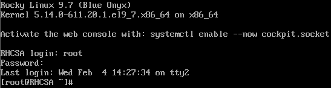

# 서버 tty 로그인 문제 해결 - PAM 설정의 무결성 변조와 스케쥴링 대책
---
TODO:
1. 스크립트 작성 및 cron 스케쥴링
<!--
3. tripwire 설치
4. 시각화
-->
---

## ㄱ. 개요
* systemctl 서브커맨드 사용 중 발생한 로그인 불가 문제를 해결
* 계정 점검 명령어를 통해 원인을 진단
* 서버의 백업 활용이 불가능 할 때, 원격으로 접속해 문제를 해결
* 점검 스케쥴링을 통한 재발 방지

### 문제
* 발생 시각
    - 2026년 02월 04일 오후 12시 30분 경

* 해결 시각
    - 2026년 02월 04일 오후 14시 30분 경

* 발생 경로
    - 명령어 입력 후 로그인 시 'login incorrect'라는 문구가 출력됨
    - 이는 로그인 불가를 의미하여 서버 로그인 시스템에 문제가 생겼음을 확인

* 주요 증상
    - 문제의 서버가 isolate multi-user 대상 시스템에서 로그인 불가
        ```bash
        [examuser]$ systemctl isolate multi-user.target
        ```
    - 

* 문제 인식
    - 동일 커널 버전 다른 릴리즈의 리눅스 서버에서 정상 로그인됨을 확인
        + 문제의 서버: Rocky 9.7(Linux RHCSA 5.14.0-611.20.1.el9_7.x86_64)
        + 실험용 서버: Rocky 9.6(Linux Rocky 5.14.0-570.17.1.el9_6.x86_64)

* 초동 대처
    - 문제가 발생한 서버를 종료하지 않고 문제 해결 시도
    - 실험용 서버에서는 정상 작동 확인
    - 문제의 서버로 원격 접속 성공하여 해결 진행

### 원인
* PAM의 설정 파일인 login 파일의 무결성이 변조된 이력이 발견되었음 

### 주요 명령어
* systemctl
    - 시스템 대부분의 서비스를 총괄하는 명령
* man
    - 명령어의 상세 설명서
* vim
    - 파일 내용 편집

### 활용 도구 등
* Microsoft Copilot(Personal)
    - 원인 탐색 및 해결책 제시
    - 문서 검토
* RedHat Rocky Linux 9.6(Linux Rocky 5.14.0-570.17.1.el9_6.x86_64)
    - 정상 동작 시스템
* 참고 문서
    - GNU man

***

## ㄴ. 해결
### 원인
* PAM의 login 파일 무결성에 문제가 있었기에 패키지 재설치를 통해 원본 파일을 복구하였음
    - 과거 공부 중 PAM 설정에 의해 securetty.so 파일을 삽입하였던 적이 있었음
    - 패키지를 재설치 시, 설정 파일을 덮어쓰지 않음
    - 때문에 기존 설정 파일을 백업하고 패키지 재설치 후 로그인 시도하였음
        ```bash
        cd /etc/pam.d/
        mv login login.bak
        dnf reinstall util-linux
        ```
    - 
        + 기존 파일은 원본 디렉터리 내부에 'login.bak' 이름으로 보관되어 있음

### 영향
* 

### 대책
* 재발 방지를 위한 사후책
    - 설정 파일 무결성 검사를 위한 cron 스케쥴링
    ```bash
    ```

***

## ㄷ. 대처
* 대응 절차를 시간 순서로 기술
* 실험용 환경에서 원격으로 진행
    - Linux Rocky 5.14.0-570.17.1.el9_6.x86_64

### 1. 서비스 점검
#### 서버 대조
* 정상 실행 및 로그인 가능 확인
    ```bash
    [user]$ systemctl isolate multi-user.target
    ```
#### 서비스 상태 확인
* getty@tty1.service 강제 실행
    - 로그인 불가
#### 원격 접속 여부
* ssh 원격 접속 실행
    ```
    ssh root@192.168.10.130
    root@192.168.10.130's password: 
    Activate the web console with: systemctl enable --now cockpit.socket

    Last failed login: Wed Feb  4 13:58:45 KST 2026 on tty1
    There was 1 failed login attempt since the last successful login.
    Last login: Wed Feb  4 13:55:52 2026
    ```

### 2. 계정 관련 점검
#### PAM 설정 확인
* 로컬 로그인 가능 여부를 확인하였으나 기본값으로 설정되어 있었음
    ```
    vi /etc/pam.d/login
    ```
#### 계정 잠김 여부 확인
* lslogins
    - 'PWD-LOCK' 열을 확인하였으나 사용 계정이 잠기지 않았음을 확인
        - 0의 경우: 계정 잠기지 않음
        - 1의 경우: 계정 잠김
        ```
          UID USER                 PROC PWD-LOCK PWD-DENY
            0 root                    0        0        0
              ...
         1000 rocky                   0        0        0 
         1004 ExamUser                0        0        0              
        10000 tester                  0        0        0
        10001 examuser                0        0        0
        ```

---

### 3. PAM 설정 재확인
* PAM의 login 파일의 변조 기록 확인
    - rpm 명령어의 검증(-V) 옵션 사용
    - rpm -V util-linux
        ```
        rpm -V util-linux
        S.5....T.  c /etc/pam.d/login
        ```
    - 출력되면 원본 패키지에서 변조가 일어났음이 출력된 것
        + S: 파일 크기
        + 5: MD5 Checksum
        + T: 갱신일
        + .: 변조 없음


## ㄹ. 경과
* 문제를 해결 후 약 3시간 서버 접속과 로그인에 문제가 발견되거나 재발되지 않았음
* 이후 후속조치로 재발 방지를 위한 스크립트 작성 및 cron 스케쥴링을 실시함

***

## ㅁ. 후기
### 느낀점
1. 문제가 발생하였을때 그것과 관련된 지식이 없으면 탐색의 범위가 넓어질 수 밖에 없었다. 
2. 과거에 남긴 흔적은 남아있고, 지금껏 영향을 준다.
3. 배울 건 널렸고, 시간은 한정되어 있다.
4. 벽 앞에서 혼자서만 앓지 말고, 누군가와 나누던가 인공지능을 활용하는 것이 빠르다.

### 배운점
* runlevel3에서는 securetty 파일을 사용하였으며, 이는 isolate multi-user에서 로그인할 수 없는 결과를 초래하였다. 반면 GDM에서는 사용하지 않으며 영향이 없었다.

* Timestamp
    - 명령어 사용 시각을 알기 위해 history에 시간 출력을 적용해두어야 한다.
        ```
        echo -e '# history timestamp\nexport HISTTIMEFORMAT="%F %T "' >> ~/.bashrc
        source ~/.bashrc
        history | tail -n 1
         1009  2026-02-04 15:11:26 history | tail -n 1
        ```

***

## ㅂ. 기록
* History
    - 문제의 서버
        + user: root
            ```
            974  2026-02-04 15:09:13 su - examuser
            975  2026-02-04 15:09:13 systemctl status getty@tty1.service 
            976  2026-02-04 15:09:13 systemctl status sshd.service 
            977  2026-02-04 15:09:13 systemctl enable --now sshd.service 
            978  2026-02-04 15:09:13 systemctl status sshd.service 
            979  2026-02-04 15:09:13 systemctl enable --now getty@tty1.service 
            980  2026-02-04 13:25:09 uname -a
            981  2026-02-04 13:35:00 systemctl status getty@tty1.service 
            982  2026-02-04 13:36:29 export HISTTIMEFORMAT="%F %T "
            983  2026-02-04 13:36:31 history
            984  2026-02-04 13:53:03 systemctl cat multi-user.target
            985  2026-02-04 13:53:03 systemctl list-dependencies multi-user.target | grep getty
            986  2026-02-04 13:53:26 systemctl enable --now getty@tty1.service 
            987  2026-02-04 15:09:13 vi /etc/ssh/sshd_config
            988  2026-02-04 15:09:13 ip a
            989  2026-02-04 15:09:13 systemctl enable --now getty@tty1.service 
            990  2026-02-04 14:24:27 ssh examuser@localhost
            991  2026-02-04 14:24:34 history 
            992  2026-02-04 14:24:52 export HISTTIMEFORMAT="%F %T " >> ~/.bashrc 
            993  2026-02-04 14:24:55 source ~/.bashrc 
            994  2026-02-04 14:24:57 history
            995  2026-02-04 14:25:42 systemctl status getty@tty1.service 
            996  2026-02-04 14:25:49 w
            997  2026-02-04 14:26:01 ps -ef | grep systemd
            998  2026-02-04 14:27:10 systemctl isolate runlevel3.target 
            999  2026-02-04 15:09:16 history | tail
            1000  2026-02-04 15:09:30 tail ~/.bashrc
            1001  2026-02-04 15:09:38 echo '"export HISTTIMEFORMAT="%F %T "' >> ~/.bashrc
            1002  2026-02-04 15:09:40 source ~/.bashrc
            1003  2026-02-04 15:09:50 echo 'export HISTTIMEFORMAT="%F %T "' >> ~/.bashrc
            1004  2026-02-04 15:09:58 source ~/.bashrc
            1005  2026-02-04 15:10:00 vi ~/.bashrc
            1006  2026-02-04 15:11:02 history | tail
            1007  2026-02-04 15:11:08 source ~/.bashrc
            1008  2026-02-04 15:11:09 history | tail
            1009  2026-02-04 15:11:26 history | tail -n 1
            1010  2026-02-04 15:12:42 history
            ```
        + user: examuser
            ```
            36  sudo systemctl isolate multi-user.target 
            37  sudo visudo
            38  man visudo
            39  man sudoers
            40  sudo systemctl isolate multi-user.target 
            41  exit
            42  history
            ```
            
    ---

    - 실험용 서버
        + 문제의 서버로 원격 접속
            ```
            983  2026-02-04 13:58:52 su - examuser
            984  2026-02-04 13:58:52 systemctl status getty@tty1.service 
            985  2026-02-04 13:58:52 systemctl status sshd.service 
            986  2026-02-04 13:58:52 systemctl enable --now sshd.service 
            987  2026-02-04 13:58:52 systemctl status sshd.service 
            988  2026-02-04 13:58:52 systemctl enable --now getty@tty1.service 
            989  2026-02-04 13:25:09 uname -a
            990  2026-02-04 13:35:00 systemctl status getty@tty1.service 
            991  2026-02-04 13:36:29 export HISTTIMEFORMAT="%F %T "
            992  2026-02-04 13:36:31 history
            993  2026-02-04 13:53:03 systemctl cat multi-user.target
            994  2026-02-04 13:53:03 systemctl list-dependencies multi-user.target | grep getty
            995  2026-02-04 13:53:26 systemctl enable --now getty@tty1.service 
            996  2026-02-04 13:58:52 vi /etc/ssh/sshd_config
            997  2026-02-04 13:58:52 ip a
            998  2026-02-04 13:58:52 systemctl enable --now getty@tty1.service 
            999  2026-02-04 14:00:25 systemctl status systemd-logind
            1000  2026-02-04 14:00:35 systemctl status getty@tty1.service 
            1001  2026-02-04 14:01:17 vi /etc/pam.d/login 
            1002  2026-02-04 14:03:05 visudo
            1003  2026-02-04 14:03:42 lslogins
            1004  2026-02-04 14:03:45 lslogin
            1005  2026-02-04 14:04:05 man lslogins
            1006  2026-02-04 14:09:11 getenforce
            1007  2026-02-04 14:09:13 setenforce 0
            1008  2026-02-04 14:09:14 getenforce
            1009  2026-02-04 14:16:52 rpm -V util-linux
            1010  2026-02-04 14:17:11 setenforce 1
            1011  2026-02-04 14:17:12 getenforce
            1012  2026-02-04 14:17:45 vi /etc/pam.d/login 
            1013  2026-02-04 14:19:10 dnf reinstall util-linux
            1014  2026-02-04 14:19:21 rpm -V util-linux
            1015  2026-02-04 14:19:26 vi /etc/pam.d/login 
            1016  2026-02-04 14:22:49 authselect select sssd --force
            1017  2026-02-04 14:22:53 rpm -V util-linux
            1018  2026-02-04 14:24:02 systemctl isolate graphical.target 
            1019  2026-02-04 14:25:18 echo "test"
            1020  2026-02-04 14:27:26 systemctl isolate runlevel5.target 
            1021  2026-02-04 14:28:06 man runlevel 
            1022  2026-02-04 14:28:21 man systemd.target
            1023  2026-02-04 14:28:29 man systemctl
            1024  2026-02-04 14:30:07 cd /etc/pam.d
            1025  2026-02-04 14:30:07 pwd
            1026  2026-02-04 14:30:14 ll
            1027  2026-02-04 14:30:30 mv login login.bak
            1028  2026-02-04 14:30:39 dnf reinstall util-linux
            1029  2026-02-04 14:30:48 rpm -V util-linux
            1030  2026-02-04 14:31:10 diff login login.bak 
            1031  2026-02-04 14:31:31 systemctl isolate multi-user.target 
            1032  2026-02-04 14:53:12 man rpm
            1033  2026-02-04 15:08:46 systemctl start graphical.target 
            1034  2026-02-04 15:14:23 history
            ```
        + root
            ```
            196  2026-02-04 12:54:37 getenforce
            197  2026-02-04 12:54:37 systemctl status getty@tty1.service 
            198  2026-02-04 12:54:37 systemctl status sshd.service 
            199  2026-02-04 12:54:37 systemctl enable --cockpit.socket
            200  2026-02-04 12:54:37 systemctl enable cockpit.socket
            201  2026-02-04 12:54:37 ifconfig
            202  2026-02-04 12:54:37 systemctl status getty@tty1.service 
            203  2026-02-04 12:54:37 systemctl isolate graphical.target 
            204  2026-02-04 12:56:01 export HISTTIMEFORMAT="%F %T "
            205  2026-02-04 12:56:02 history
            206  2026-02-04 12:56:22 last -s -1day
            207  2026-02-04 13:24:55 uname -a
            208  2026-02-04 13:49:26 systemctl status getty@tty1.service 
            209  2026-02-04 13:53:14 systemctl cat multi-user.target
            210  2026-02-04 13:53:14 systemctl list-dependencies multi-user.target | grep getty
            211  2026-02-04 13:54:48 grep tty1 /etc/securetty
            212  2026-02-04 13:55:22 sudo journalctl -b | grep -i pam
            213  2026-02-04 13:55:23 sudo journalctl -b | grep -i auth
            214  2026-02-04 13:58:53 ssh root@192.168.10.130
            215  2026-02-04 15:15:00 echo -e '# history timestamp\nexport HISTTIMEFORMAT="%F %T "' >> ~/.bashrc
            216  2026-02-04 15:16:59 source ~/.bashrc
            217  2026-02-04 15:17:00 history
            ```
***